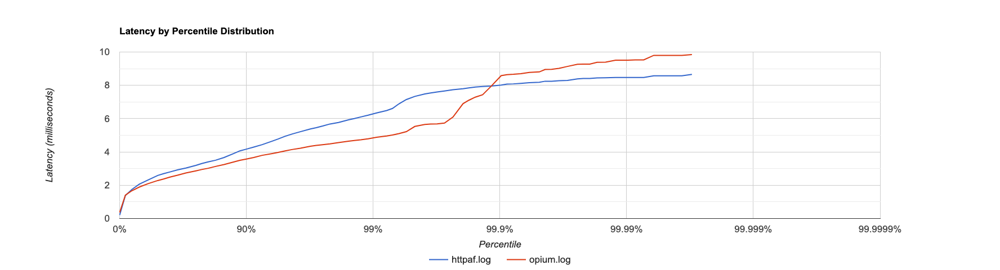

# Opium Benchmark

Benchmarking of Opium with `wrk2`.

## Install wrk

We use wrk2 to generate the benchmark.

If you're on macOS, you can install wrk2 with:

```sh
brew tap jabley/homebrew-wrk2
brew install --HEAD wrk2
```

## Run the benchmarks

To run a benchmark, simply execute the `run.sh` script:
```sh
./benchmark/run.sh
```

It will spawn the servers and kill them when the benchmarks are over.

## Results

The results of the benchmarks can be found in `result/opium.log`.

Here's a plot of the historgram with all of them.



It has been generated with [hdrhistogram](http://hdrhistogram.github.io/HdrHistogram/plotFiles.html).
